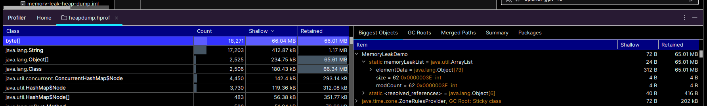
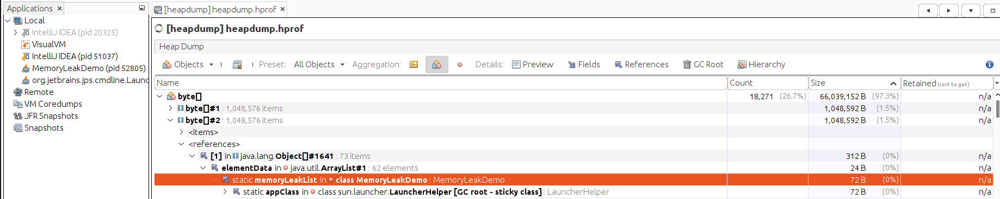
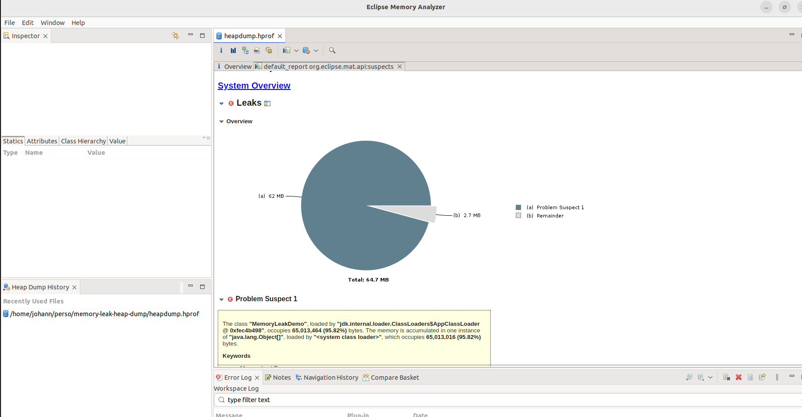

# Heap dump to resolve memory leak

## Start app

JVM arguments:
```shell
-Xms128m -Xmx128m -XX:+HeapDumpOnOutOfMemoryError -XX:HeapDumpPath=/tmp/heapdump.hprof
```

## Analyse Heap dump

### With IntelliJ



### JVisualVM



### Memory Analyzer (MAT)



https://eclipse.dev/mat/download/ 
